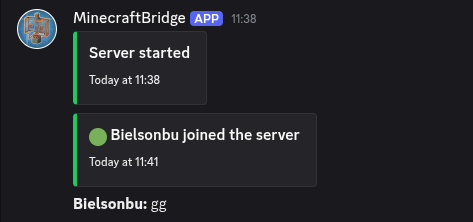
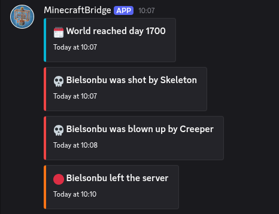
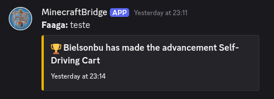
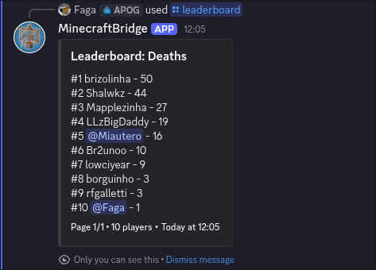

# MC Discord Bridge

Server-side NeoForge mod for Minecraft `1.21.x` that runs an embedded Discord bot and bridges events/chat.

## Features
- Minecraft -> Discord bridge for server lifecycle, player join/leave, deaths, advancements, and day milestone announcements
- Discord -> Minecraft chat relay via `/mc` slash command in the configured channel (with mention sanitization)
- `/mc` relays to Minecraft and echoes plain text back to Discord (`**name:** message`)
- `/mc` uses linked Minecraft nickname when the Discord user is linked
- Rich Discord embeds with per-event colors, timestamps, optional player head thumbnails, and plain-text fallback
- Bot activity rotation with configurable activity list, interval, and type (`PLAYING`, `WATCHING`, `LISTENING`, `COMPETING`)
- Admin logging channel with command redaction and structured admin embeds
- Discord setup wizard via guild text commands: `!bridge setup`, `!bridge chat <channelId>`, `!bridge admin <channelId>`
- Discord/Minecraft account linking via `/link` (ephemeral one-time code) and in-game `/bridge link <code>`
- `/leaderboard` slash command with categories, pagination, and visibility (`private` default, optional `public`)
- Leaderboards include online and offline players with saved stats
- Linked players are shown as Discord mentions (`<@discordUserId>`) in leaderboard and embeds
- Bot activity rotation includes a built-in online/max players status entry
- Resilient startup/runtime behavior: Discord failures are logged, startup messages are queued until JDA is ready

## Requirements
- Java 21
- NeoForge server compatible with one of the configured release matrix targets (currently `1.21.1` to `1.21.11`)
- Discord bot token and bot invited to your server

## Screenshots
### Chat and Event Messages




### Leaderboard


## Discord Bot Permissions
Bot permissions:
- Read Messages / View Channels
- Send Messages
- Read Message History

## Configuration
First run creates `serverconfig/mcdiscordbridge-server.toml`.

```toml
# Discord bot token or env:DISCORD_BOT_TOKEN
discordApiKey = "env:DISCORD_BOT_TOKEN"

# Only messages from this guild are accepted
whitelistGuildId = "123456789012345678"

# Discord channel for chat bridge
chatChannelId = "123456789012345678"

# Discord channel for admin logs
adminLogChannelId = "123456789012345678"

# Legacy toggle for text-message relay mode (slash command `/mc` does not require this)
enableMessageContentIntent = false

# Send Discord embeds for richer event logs
enableEmbeds = true

# Hex color for embeds, for example #57A5FF
embedColorHex = "#57A5FF"

# Include player head thumbnail in embeds when UUID is available
includePlayerHeadInEmbeds = true

# URL template with %uuid% placeholder
playerHeadUrlTemplate = "https://crafatar.com/avatars/%uuid%?size=128&overlay"

# Rotate bot activity text from botActivities
enableBotActivityRotation = true
botActivities = ["Watching the server", "Bridging chat", "Tracking events"]
botActivityRotateSeconds = 20

# PLAYING, WATCHING, LISTENING, COMPETING
botActivityType = "WATCHING"

# Send day milestone message every N minecraft days (0 disables)
dayMilestoneGap = 10

# Enable Discord account linking to Minecraft players
enableAccountLinking = true

# How long link codes remain valid
linkCodeExpirySeconds = 600

# Length of one-time account link code
linkCodeLength = 6
```

### Token via environment variable
Set:
```bash
export DISCORD_BOT_TOKEN="your_token"
```

Then set in config:
```toml
discordApiKey = "env:DISCORD_BOT_TOKEN"
```

## Setup Wizard
In your whitelisted Discord server, run:
```text
!bridge setup
```

Then complete:
- `!bridge chat <channelId>`
- `!bridge admin <channelId>`

Only Discord admins can run setup.

## Account Linking
- On Discord, run slash command: `/link`
- The bot replies ephemerally with a one-time code
- In Minecraft, run: `/bridge link <code>`
- `linkCodeExpirySeconds` controls how long the code remains valid

## Discord to Minecraft Relay
- On Discord in the configured chat channel, run: `/mc <message>`
- The message is relayed to Minecraft chat as `[Discord] <name> message`
- The same message is echoed in Discord as plain text: `**name:** message`
- If the Discord account is linked, `name` uses the linked Minecraft nickname

## Leaderboard
- On Discord, run: `/leaderboard <category>`
- Optional page: `/leaderboard <category> <page>`
- Optional visibility: `/leaderboard <category> <page> <visibility>` where `visibility` is `private` (default) or `public`
- Linked players are shown with Discord mention tags (`<@discordUserId>`)
- Categories: `playtime`, `deaths`, `player_kills`, `mob_kills`, `mined_blocks`, `distance_walked`
- Leaderboard responses are ephemeral by default

## Development
Use Makefile helpers:
```bash
make setup
make build
make run-server
make run-prod-local
make test
make jar-info
```

Or directly:
```bash
./gradlew build
```

Output jar is in `build/libs`.

## Releases
- Releases are triggered by pushing a tag matching `v*` (for example `v0.1.2`).
- Release build version is derived from the tag (`v0.1.2` -> `0.1.2`) and passed to Gradle at build time.
- Release assets are normalized to include loader and Minecraft version, for example:
  - `mcdiscordbridge-neoforge-mc1.21.1-0.1.2.jar`
  - `mcdiscordbridge-neoforge-mc1.21.1-0.1.2-sources.jar`

`make run-prod-local` installs a local NeoForge server in `.local-neoforge-server`, copies the built mod jar into `mods/`, accepts EULA for local testing, and starts the server using NeoForge's production launch args.

## Notes
- This is server-only. Do not install on clients.
- Discord failures are logged and do not intentionally crash server startup.
- Avoid logging secrets in command usage; redaction is enabled by default.
